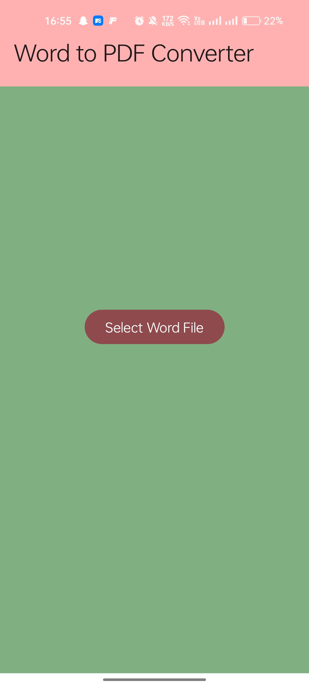
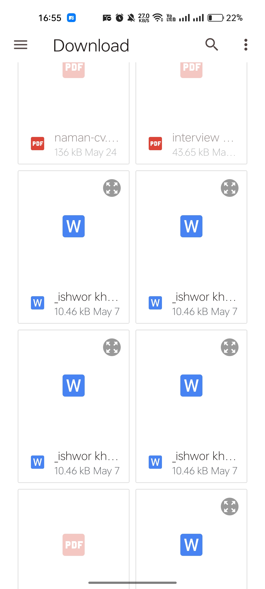
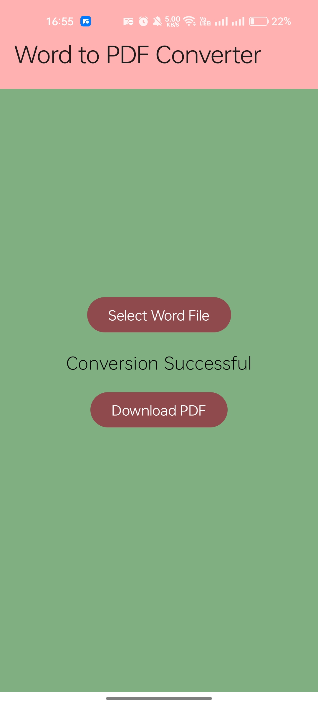
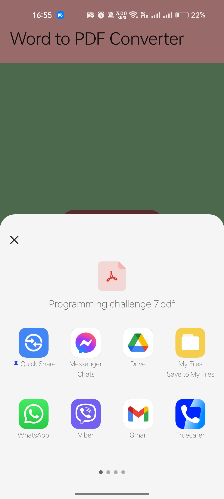
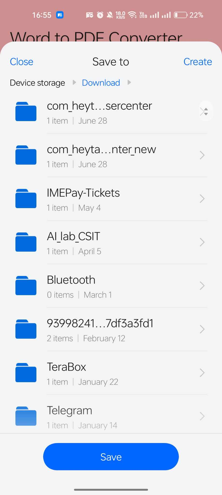

---

# 📄 Word to PDF Converter

🚀 A simple Android app to convert Word documents (.docx) into PDF files using Apache POI and iText7.

## ✨ Features

- 📚 **Convert DOCX to PDF**: Easily convert your Word documents into PDF format.
- ⚡ **Fast and Efficient**: Leveraging Apache POI for parsing and iText7 for PDF conversion.
- 🛠️ **Easy to Use**: Simple and intuitive user interface.

## 📦 Dependencies

- **Apache POI**: For parsing DOCX files.
- **iText7**: For generating PDF files.

## 🛠️ Setup

1. **Clone the Repository**
    ```bash
    git clone https://github.com/yourusername/word-to-pdf-converter.git
    cd word-to-pdf-converter
    ```

2. **Open in Android Studio**
    - Open the project in Android Studio.

3. **Add Dependencies**
    - Add the following dependencies to your `build.gradle` file:
    ```gradle
    dependencies {
        implementation "org.apache.poi:poi-ooxml:5.2.3"
        implementation "com.itextpdf:itext7-core:7.2.3"
    }
    ```

4. **Build and Run**
    - Build and run the app on your Android device or emulator.

## 📝 Usage

1. **Select Word File**
    - Choose a `.docx` file from your device.

2. **Convert to PDF**
    - Tap the "Convert" button to start the conversion process.

3. **Save PDF**
    - Save the generated PDF file to your desired location.

## 🌟 Screenshots







## 🤝 Contributing

Contributions are welcome! Feel free to open issues or submit pull requests.

1. Fork the repository
2. Create a new branch (`git checkout -b feature-branch`)
3. Commit your changes (`git commit -am 'Add new feature'`)
4. Push to the branch (`git push origin feature-branch`)
5. Create a new Pull Request

## 📜 License

This project is licensed under the MIT License. See the [LICENSE](LICENSE) file for more details.

## 📬 Contact

For any inquiries or feedback, please reach out to me at [ishworback123@example.com](mailto:ishworback123@example.com).

